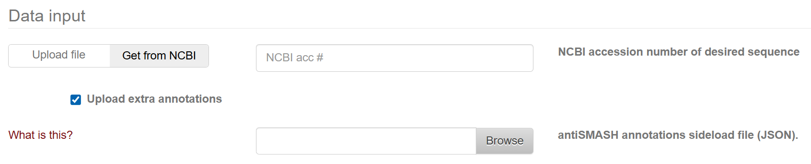

# **BGC-MAC and BGC-MAP: Attention-Based Models for Accurate Classification and Product Matching of Biosynthetic Gene Clusters**

<p align="center">
      <a href="https://www.python.org/">
        </a>
       <a href= "https://pytorch.org/">
        </a>
      <a href= "https://doi.org/10.5281/zenodo.15206672">
        </a>
</p>

## Setup

### Configuration requirement
1. Train with pre-computed ESM embedding
- **Minimum VRAM**:  1GB VRAM
- **GPU Compatibility**: Consumer-grade graphics cards are sufficient for training
- **BGC-MAC Training**: Can be trained using CPU only
2. Inference


    (1) **ESM Embedding Calculation:**
- **VRAM Requirement**: 13GB VRAM for ESM-650M

    (2) **Model Inference:**
- **VRAM Requirement**: <1GB VRAM sufficient
- **Hardware Compatibility**: Consumer-grade graphics cards or CPU
- **CPU Inference**: Fully supported for all models (If you have pre-computed ESM-embedding, ortherwise CPU inference is not recommended)
### 
3. Performance Benchmarks

    Training Time on RTX 4090 (9-Ensemble Models)：
- **BGC-MAC**: Approximately 15-20 minutes
- **BGC-MAP**: Approximately 2.5 hours

### Environment setup
```bash
  conda env create -f environment.yml
  conda activate natural_product
  # Install local package.
  # Current directory should be natural_product/
  pip install -e .
```
## Reproducing Results
### Data Preprocessing (optional)
Training data and checkpoint files can be downloaded at [Zenodo](https://zenodo.org/records/15206672) .
1. Download MIBiG raw data
```bash
wget https://dl.secondarymetabolites.org/mibig/mibig_json_4.0.tar.gz
wget https://dl.secondarymetabolites.org/mibig/mibig_gbk_4.0.tar.gz
```

After downloading, extract the files and place them in the `./data` directory. Rename the directories to exactly:

- `mibig_gbk_4.0`
- `mibig_json_4.0`

2. Download pfam hmm file
```bash
wget https://ftp.ebi.ac.uk/pub/databases/Pfam/current_release/Pfam-A.hmm.gz
```

Extract the file and place them in the `./data` directory.
Ensure the path is `/data/Pfam-A.hmm`

3. Download ESM2 weights (see Usage Instructions-Prerequisites part)

4. Download `COCONUT_DB_absoluteSMILES.smi` 

5. Then run:

```bash
cd data_preparation
python extract_BGCs.py 
# Will generate three files: 
# ./data/BGC_4.0/MAC_metadata.pkl 
# ./data/BGC_4.0/BGC_gene_kind.pkl
# ./data/BGC_4.0/MAP_metadata.pkl
python pfam_annotation.py 
# Will generate one file: ./data/BGC_4.0/BGC_domain_pfam.pkl
python esm2_emb_cal.py 
# Will generate one file: ./data/BGC_4.0/Esm2_rep_mibig.pth
```

### Experiments
0. If you skip data preprocessing step, please download `BGC_4.0.zip` and place it in `./data` directory

    Before training, make sure `./data/BGC_4.0` has the following five files:
    - `BGC_domain_pfam.pkl`
    - `BGC_gene_kind.pkl`
    - `Esm2_rep_mibig.pth`
    - `MAC_metadata.pkl`
    - `MAP_metadata.pkl`

1. Download the following test files and place them in:
    - `./ckpt/BGC_MAC/test_MAC_metadata_43.pkl`
    - `./ckpt/BGC_MAP/test_MAP_metadata_42.pkl`
2. Execute experiments:

```bash
cd experiment

# Training
python train.py --model MAC
python train.py --model MAP

# Evaluation (replace 'your_ckpt_dir_name' with actual directory)
python test.py --model MAC --ckpt your_ckpt_dir_name --mean_result
python test.py --model MAP --ckpt your_ckpt_dir_name --mean_result

# To evaluate individual models in an ensemble (without mean results):
python test.py --model MAC --ckpt your_ckpt_dir_name 
python test.py --model MAP --ckpt your_ckpt_dir_name 

```
### Analysis
Run the notebook in `/visualization` directory to reproduce figures in the paper.


| Filename | Directory |
|--------|----------|
| MAC_test_ensemble.pkl | `\ckpt\MAC_default` |
| MAC_test_individual.pkl | `\ckpt\MAC_default` |
| MAP_test_ensemble.pkl | `\ckpt\MAP_default` |
| MAP_test_individual.pkl | `\ckpt\MAP_default` |
| antismash_annotation.zip | `\data` |
| deepbgc.zip | `\data` |
| NPatlas_ECFP.pkl | `\data\natural_product` |
| knownclusterblast_MACtest_hits.csv | `\data\border` |
| NPAtlas_download_2024_09.tsv | `\data\natural_product` |
| output.zip | `\output` |


### Download GenBank File for fungi BGC and BGC border analysis
1. **all fungi bgc**

-  Query antiSMASH-db with {[superkingdom|Eukaryota]}.

- Download GenBank file and place them in `\data\fungi_bgc`.

2. **BGC border analysis**

- Query antiSMASH-db with knownclusterblast with similarity greater than and equal to 100.

- Download GenBank file and place them in `\data\border`.
## Usage Instructions 
### Prerequisites
1. Download pretrained ESM2 weights from [https://zenodo.org/records/7566741](https://zenodo.org/records/7566741)
    - [esm2_t33_650M_UR50D-contact-regression.pt](https://zenodo.org/records/7566741/files/esm2_t33_650M_UR50D-contact-regression.pt?download=1)
    - [esm2_t33_650M_UR50D.pt](https://zenodo.org/records/7566741/files/esm2_t33_650M_UR50D.pt?download=1)
    
    Place both files in `./data`
    
2. Place checkpoint files in:
    - `ckpt/BGC_MAC/MAC_default/MAC_default.ckpt`
    - `ckpt/BGC_MAP/MAP_default/MAP_default.ckpt`
    
    Make sure: The filename stem (without extension) of a .ckpt file must match the name of its parent directory

### Input Format 
For BGC input, BGC-MAC and BGC-MAP accept **BGC GenBank files in antiSMASH format**. There are no explicit size limitations on the input BGC. However, longer inputs (>1,000 domains) may lead to increases in memory usage and inference time .

If you use deepBGC or Sanntis to detect BGC, these tools will provide a JSON file that, when used as input to antiSMASH alongside the original genome file, generates an antiSMASH-annotated version of the BGCs (See https://docs.antismash.secondarymetabolites.org/sideloading/).

Users can check the *Upload extra annotations* box in antiSMASH webserver, and upload the json file alongside the original input genome file (Genbank or fasta format) for other tools. The resulting output GenBank file is compatible with BGC-MAC and BGC-MAP.


### Output Format
Both model will output a csv file containing the prediction score of each class or each given BGC-product pair.
For BGC/product ranking task, users need to manually sort the prediction scores.

### Example
1.  **Single BGC classification**: Directly provide GBK file path
2.  **Multiple BGC classification**: Provide directory path (automatically processes all GBK files)


```bash
cd experiment

#Multiple BGC classification
python predict_new.py --gbk ../data/mibig_gbk_4.0/49.gbk

#Single BGC classification
python predict_new.py --gbk ../data/example
```


3. **Single product matching**: Provide SMILES string directly
4. **Multiple product matching**: Provide a pickle file 
containing:
    - A list with length matching the number of GBK files
    - Each element is a sublist representing products to match for that BGC
- **BGC_ranking**: Provide the directory path for all candidate BGC and a SMILES string.


Example format for 4 BGCs:

```python
smiles = [
    ["CCO", "C=O"],          
    ["C1=CC=CC=C1", "CCN"],  
    ["O=C(O)C", "C#N"],    
    ["CC(C)=O", "CCl"]  
]
```

```bash
cd experiment

#Single product matching
python predict_new.py --gbk ../data/example/BGC0001178.gbk --smiles "O=C1N[C@@H](C2=CC(O3)=CC(OS(O)(=O)=O)=C2)C(N[C@@H](C(N[C@@H]45)=O)C6=CC(OC7=C(Cl)C=C(C[C@@H]1NC(C(C8=CC3=C(O)C(Cl)=C8)=O)=O)C=C7)=C(O[C@@H]9[C@H](OC%10O[C@@H](C)[C@@H](O)[C@](N)(C)C%10)[C@@H](O)[C@H](O)[C@@H](CO)O9)C(OC%11=CC=C([C@@H](O)[C@H](NC4=O)C(N[C@@H](C(O)=O)C%12=CC(O)=CC(O)=C%12C%13=CC5=CC(Cl)=C%13O)=O)C=C%11Cl)=C6)=O"

#Multiple product matching (Ensure example directory have 4 GenBank file)
python predict_new.py --gbk ../data/example --smiles ../data/smiles.pkl

```

5. BGC/Product ranking
- BGC: Provide a single BGC GenBank file, or a directory path containing multiple BGC GenBank files
- Product: Provide a SMILES string, or provide a pickle file contianing a list with several SMILES strings


```bash
cd experiment

# Single BGC query Product candidates
python predict_new.py --gbk ../data/natural_product/test_table2/BGC0000448.gbk --ckpt MAP_default  --smiles ../data/natural_product/NP_cluster_42_MAP_test.pkl --esm_cache ../data/BGC_4.0/Esm2_rep_mibig.pth --ranking 

# Single product query BGC candidates
python predict_new.py --gbk ../data/genome_ranking/BGC0001790 --ckpt MAP_default --smiles "C[C@H](C(=O)N[C@]1(CN(C1=O)S(=O)(=O)O)OC)NC(=O)CC[C@H](C(=O)O)N" --ranking
# Multiple BGC query mutiple product candidates
python predict_new.py --gbk ../data/natural_product/test_table2 --ckpt MAP_default  --smiles ../data/natural_product/NP_cluster_42_MAP_test.pkl --esm_cache ../data/BGC_4.0/Esm2_rep_mibig.pth --ranking
```

### Using esm cache
During inference, the script will compute ESM2-650M embeddings and save as pkl file in `data/cache` directory. When you run a large scale prediction for a second time, use `--esm_cache path_to_pkl_file` to load these embeddings.

**Note:** Cache file is a dictionary, where key is the basename of GenBank File (without extension), and value is ESM embedding.